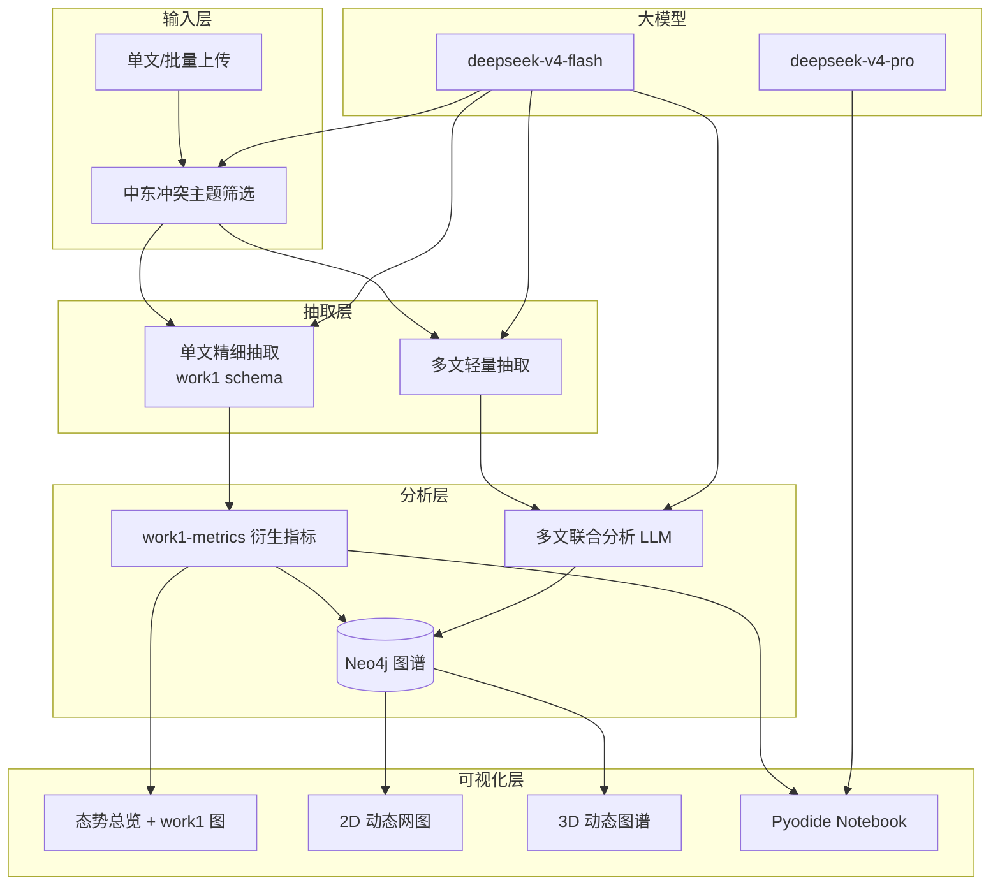

# 中东冲突态势分析台 v3 — 详细任务线

> 基于 work1 (`src/`) 反思与借鉴，将 work group 从「泛化单文档图谱」升级为「单文精细 + 多文联合 + 代码大模型 Notebook」的完整可视化分析平台。

---

## 一、问题诊断（现状 vs 目标）

| 维度 | 现状 (v2) | work1 参考 | 目标 (v3) |
|------|-----------|------------|-----------|
| 实体抽取 | 13 类泛化军事情报 schema，仅 `{id,type}` | 8 类新闻 schema + aliases/summary/attributes | **单文精细抽取**（work1 级字段）+ **多文轻量抽取** |
| 分析尺度 | 单文档上传 | 503 篇语料批处理 | 单文详细分析 + 多文联合分析 |
| 可视化 | 6 视图基础 Plotly | 15+ 静态图（t-SNE、Sankey、关联规则网） | work1 基础图 + **2D 动态网图** + **2D/3D 动态可视化** |
| 代码分析 | 无 | Python 脚本管线 | **内置代码大模型** → 浏览器端 Jupyter (Pyodide) |
| 主题约束 | 无 | 中东冲突 RSS 语料 | **强制中东冲突主题** + 可解析文件类型 |
| LLM | deepseek-chat (legacy) | deepseek-chat | **deepseek-v4-flash / deepseek-v4-pro** |

---

## 二、任务线（分阶段）

### Phase 1 — 基础设施 ✅ 本次实现

- [x] **T1.1** DeepSeek V4 接入：`deepseek-v4-flash`（抽取/对话）、`deepseek-v4-pro`（代码生成）
- [x] **T1.2** 文章主题筛选：上传前 LLM + 关键词双重校验「中东冲突」
- [x] **T1.3** 文件类型白名单：新闻/文本类（txt, md, pdf, docx, csv, json）；排除图片/音视频/二进制
- [x] **T1.4** 双模式实体抽取：
  - `single_detailed`：work1 级 schema（aliases, summary, attributes, 8 实体 + 12 关系）
  - `multi_corpus`：轻量 schema，适合多文联合
- [x] **T1.5** 任务线文档（本文档）

### Phase 2 — 单文精细分析 ✅ 本次实现

- [x] **T2.1** 精细抽取提示词（移植 `src/extract_entities_llm.py`）
- [x] **T2.2** work1 风格衍生指标：实体共现矩阵、关系三元组流、事件分类分布
- [x] **T2.3** Overview 增强：关键词共现网络、实体共现热力图（对齐 work1 `llm_04`/`llm_05`）
- [x] **T2.4** 知识图谱：新增 **2D 动态力导向网图**（时间帧/迭代动画）

### Phase 3 — 多文联合分析 ✅ 本次实现

- [x] **T3.1** 批量上传 API：`POST /api/upload-batch`
- [x] **T3.2** 文章库管理：主题标签、质量分、共同主题筛选
- [x] **T3.3** 联合分析提示词：串接多篇文章 → 跨文实体对齐、主题脉络、冲突演化叙事
- [x] **T3.4** 多文分析前端：`MultiArticle.vue`（筛选 → 联合分析 → 结果展示）

### Phase 4 — 代码大模型 + 浏览器 Notebook ✅ 本次实现

- [x] **T4.1** Notebook 生成提示词（参考 work1 `visualize_report.py` + `llm_deep_analysis.py`）
- [x] **T4.2** `POST /api/generate-notebook`：DeepSeek V4 Pro 生成 `.ipynb` JSON
- [x] **T4.3** `NotebookLab.vue`：Pyodide 浏览器端执行 Python，matplotlib/networkx 可视化
- [x] **T4.4** 数据输入：抽取实体 JSON 或文章 KDD 标签

### Phase 5 — 动态可视化 ✅ 本次实现

- [x] **T5.1** `DynamicViz.vue`：2D 动态网络（节点脉冲 + 力导向动画）
- [x] **T5.2** 2D 时序态势：事件时间线 + 关系类型演化条形动画
- [x] **T5.3** 3D 动态图谱：Plotly 3D scatter 旋转 + 关系边动态高亮

### Phase 6 — 深度分析 + 多智能体 ✅ 已完成

- [x] **T6.1** 规则挖掘 `analysis/rule-mining.js`（actor-action-consequence，仅上传文本）
- [x] **T6.2** KDD 层 `analysis/kdd-analysis.js`（TF-IDF + KMeans + 关联规则）
- [x] **T6.3** 语义景观 `analysis/tsne-lite.js`（Truncated SVD 2D 投影）
- [x] **T6.5** 实体别名合并 `services/entity-canonicalization.js`
- [x] **T6.6** 多智能体 Notebook 管线 `services/agents/notebook-pipeline.js`
  - DataProfiler → VizPlanner → CodeWriter → CodeReviewer
  - 仅基于用户上传文章数据，**网页不含爬虫**
- [x] **T6.7** E2E 测试脚本 `scripts/test-e2e-notebook.js` + 测试文章 `data/test-articles/`

**明确不做（按用户要求）**
- ~~T6.4 RSS 爬虫接入~~ — 网页端仅支持用户上传，爬虫保留在 work1 `src/` 供离线参考

---

## 三、DeepSeek V4 接入说明

```javascript
// OpenAI 兼容格式，base_url 不变
baseURL: 'https://api.deepseek.com'
model: 'deepseek-v4-flash'   // 抽取、筛选、对话（低成本高吞吐）
model: 'deepseek-v4-pro'     // Notebook 代码生成（深度推理）

// 可选参数
{
  thinking: { type: 'enabled' },  // 思考模式（pro 推荐）
  reasoning_effort: 'high',
}
```

- 官方文档：https://api-docs.deepseek.com/
- V4 发布说明：https://api-docs.deepseek.com/news/news260424
- `deepseek-chat` / `deepseek-reasoner` 将于 2026-07-24 退役

---

## 四、架构图



---

## 五、文件清单（v3 新增/修改）

| 路径 | 说明 |
|------|------|
| `docs/TASK_ROADMAP.md` | 本任务线 |
| `nodejs-app/services/prompts/extraction.js` | 单文/多文抽取提示词 |
| `nodejs-app/services/prompts/notebook.js` | Notebook 代码生成提示词 |
| `nodejs-app/services/article-filter.js` | 主题筛选 + 文件类型校验 |
| `nodejs-app/services/extraction.js` | 统一抽取逻辑 |
| `nodejs-app/services/multi-article.js` | 多文联合分析 |
| `nodejs-app/services/notebook-generator.js` | ipynb 生成 |
| `nodejs-app/analysis/work1-metrics.js` | work1 风格指标 |
| `nodejs-app/client/src/views/MultiArticle.vue` | 多文分析页 |
| `nodejs-app/client/src/views/NotebookLab.vue` | 浏览器 Notebook |
| `nodejs-app/client/src/views/DynamicViz.vue` | 动态可视化 |
| `nodejs-app/client/src/composables/usePyodide.js` | Pyodide 执行器 |
| `nodejs-app/client/src/composables/useDynamicGraph.js` | 动态网图引擎 |

---

## 六、使用流程

### 单文详细分析
1. 侧边栏选择 `deepseek-v4-flash`，配置 API Key
2. 上传 PDF/DOCX/TXT 新闻
3. 系统自动校验「中东冲突」主题 → 精细实体抽取
4. 浏览 态势总览 / 知识图谱(含动态模式) / 动态可视化 / Notebook 实验室

### 多文联合分析
1. 进入「多文联合分析」页
2. 批量上传或从文章库勾选同主题文章
3. 点击「联合分析」→ LLM 串接叙事 + 跨文实体对齐
4. 在 Notebook 实验室用联合分析数据生成可视化代码

### Notebook 代码生成
1. 进入「Notebook 实验室」
2. 选择数据源（实体抽取 / 文章标签）
3. 点击「生成 Notebook」→ V4 Pro 生成 Python 代码
4. 浏览器 Pyodide 执行，输出 matplotlib 图表
